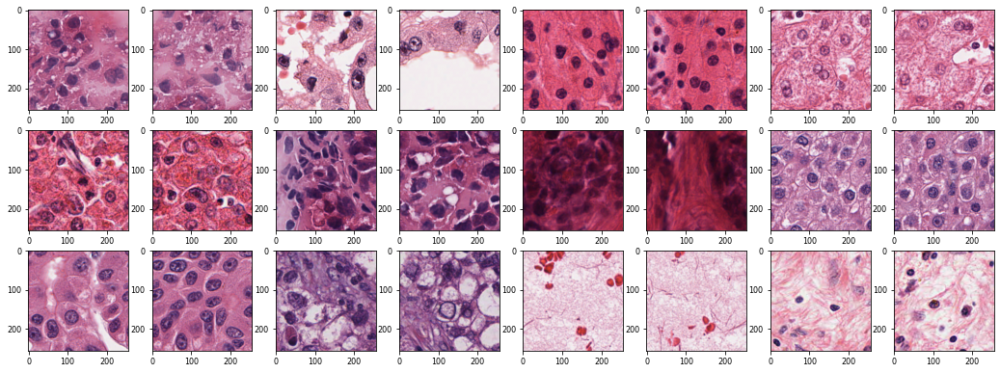

# Summary
This is a legacy code. No updates are planned.

Prepare, run, and keep track of histology image feature (tissue fingerprints) extractor experiments:
* Select base model and adjust to specific experiment needs.
* Train feature extractor model:
    * Run single experiment from json config or load an experiment config from database.
    * Store experiment config and main results in a local database.
    * Rerun when needed from DB, or initialize fine tuning by selecting a starting point from DB.
* Load trained model and use as an extractor model.

## Principle
Based on a "Deep learned tissue fingerprints" paper.[^original_article]
[^original_article]: [Rawat, R.R., Ortega, I., Roy, P. et al. Deep learned tissue “fingerprints” classify breast cancers by ER/PR/Her2 status from H&E images. Sci Rep 10, 7275 (2020).](https://doi.org/10.1038/s41598-020-64156-4)

As a base for our experiments we use large, well-known, possibly pretrained neural network models (e.g. InceptionResNetV2).
In a typical setup the base network model is configured with respect to experiment conditions, and (re)trained by learning to find pairs of patches originating from the same whole-slide image. We assume that sucessfully trained network will learn all possible tissue patterns, thus the deep feature space of the network will comprise braod enough vocabulary to describe any biologically meaningfull tissue pattern. The rationale behind this setup is backed by yet another assumption that having large enough dataset of histology images would allow us to tailor NN model for specific purposes (e.g. specific tumor/cancer type). However, this has to be proven experimentaly.<br>

## Imports/Dependencies:
Most recent setup that worked:
```python
h5py == 3.5.0
importlib-metadata == 1.5.0
mysql-connector-python == 8.0.27
numpy == 1.21.3
tensorboard == 2.7.0
tensorflow == 2.7.0
```


# Dataset
The dataset of tile labels, tiles and neigbouring tiles_ is meant to be stored in hdf5 file[^hdf5] with following structure:
[^hdf5]: [h5py user manual](https://docs.h5py.org/en/stable/)
```python
dataset.h5/
├── labels # shape = (N, ), type = ('ndarray', dtype('int64'))
├── tiles  # shape = (N, 256, 256, 3), type = ('ndarray', dtype('float64'))
└── tiles_ # shape = (N, 256, 256, 3), type = ('ndarray', dtype('float64'))

where, N =  number of WSI's.
```
In this example patches are of 256 x 256 pixels shape, and of 'float' data type (this is just for convenience - neither of these is mandatory).

<br>
In figure above: An example of randomly sampled tissue patch-pairs from TCGA LIHC cohort.[^tcga_lihc]
[^tcga_lihc]: https://portal.gdc.cancer.gov/projects/TCGA-LIHC
<br>

# Config
Model parameters can be storred in a json config file or loaded from the DB.

## Json config file
Json file should have the following structure with mandatory dictionary keys:
```python
cfg.json/
├── batch_size, type = int, value = 1
├── dataset_path, type = str, value = '/path/to/the/project/dataset/file.h5'
├── early_stopper_patience, type = int, value = 100
├── input_shape, type = str, value = '256 , 256,3' # parser handles spaces
├── log_path, type = str, value = '/path/to/the/project/log_folder/'
├── loss, type = str, value = 'categorical_crossentropy'
├── metrics, type = str, value = 'accuracy'
├── model_base, type = str, value = 'tensorflow.keras.applications.inception_resnet_v2.InceptionResNetV2'
├── num_classes, type = int, value = 26 # should hold num_classes == len(unique(dataset['labels']))
├── optimizer, type = str, value = 'SGD'
├── saved_model_path, type = str, value = '/path/to/the/project/saved_models_folder/'
├── train_epochs, type = int, value = 5000
├── train_images, type = str, value = 'tiles'
├── train_monitor, type = str, value = 'val_loss'
├── train_targets, type = str, value = 'labels'
├── valid_images, type = str, value = 'tiles_'
└── valid_targets, type = str, value = 'labels'
```

## MySQL database
DSN service requires a python file in project root directory `./DSN_config.py` that should contain a dictionary specifying connection details:
```python
local_nn_experiments_CONFIG = {
'host': 'localhost', 
'database': 'your_database_name',
'user': 'your_user_name',
'password': 'your_pasword',
}
```
The connection to the DB can then be established via mysql.connector:
```python
import mysql.connector
import DSN_config

dsn = mysql.connector.connect(**DSN_config.local_nn_experiments_CONFIG)
...
``` 
For further reading please reffer MySQL connector manual.[^mysql_con]
[^mysql_con]: [MySQL connector manual](https://dev.mysql.com/doc/connector-python/en/)

Example DB for model parameter storage and experiment result loging:
```
mysql> show tables;
+--------------------------+
| Tables_in_nn_experiments |
+--------------------------+
| experimentconfig         |
| experimentlist           |
+--------------------------+
2 rows in set (0,00 sec)

mysql> describe experimentconfig;
+--------------+--------------+------+-----+-------------------+-------------------+
| Field        | Type         | Null | Key | Default           | Extra             |
+--------------+--------------+------+-----+-------------------+-------------------+
| Id           | int          | NO   | PRI | NULL              | auto_increment    |
| ExperimentId | int          | YES  |     | NULL              |                   |
| Name         | varchar(256) | YES  |     | NULL              |                   |
| Value        | text         | YES  |     | NULL              |                   |
| CreatedTime  | timestamp    | YES  |     | CURRENT_TIMESTAMP | DEFAULT_GENERATED |
+--------------+--------------+------+-----+-------------------+-------------------+
5 rows in set (0,00 sec)

mysql> describe experimentlist;
+--------------+--------------+------+-----+-------------------+-----------------------------+
| Field        | Type         | Null | Key | Default           | Extra                       |
+--------------+--------------+------+-----+-------------------+-----------------------------+
| Id           | int          | NO   | PRI | NULL              | auto_increment              |
| Name         | varchar(256) | YES  |     | NULL              |                             |
| Status       | varchar(256) | YES  |     | NULL              |                             |
| Accuracy     | float        | YES  |     | NULL              |                             |
| CreatedTime  | datetime     | NO   |     | CURRENT_TIMESTAMP | DEFAULT_GENERATED           |
| ModifiedTime | datetime     | NO   |     | CURRENT_TIMESTAMP | DEFAULT_GENERATED           |
|                                                                on update CURRENT_TIMESTAMP |
+--------------+--------------+------+-----+-------------------+-----------------------------+
6 rows in set (0,00 sec)
```

# Usage
* Build an empty experiment.
* Configure the experiment with initial json config file (see `./cfg.json` file for refference) or load initial configuration from the DB.
* Set stepwise testing of tunable parameters (see `./run_experiment.py` file for refference):
    * Train the model.
    * To monitor the training start tensorboard:
    ```bash
    tensorboard --logdir /path/to/the/project/log_folder/ --host localhost --port 6006
    ```
    * Log performance metrics.
    * Upload config to the DB.
* Load trained model and extract tissue fingerprints (see `./extract_fingerprints.py` file for refference):
    * Get saved model path from DB (directly, or by an exsiting experiment ID).
    * Load trained model.
    * Make an extractor model by removing the last layer from the model.
    * Aggregate and save fingerprint vectors.
    
